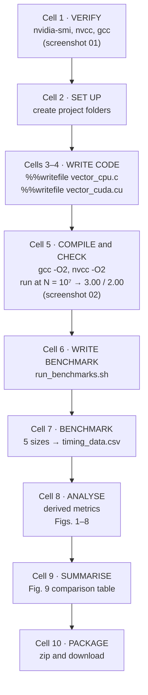
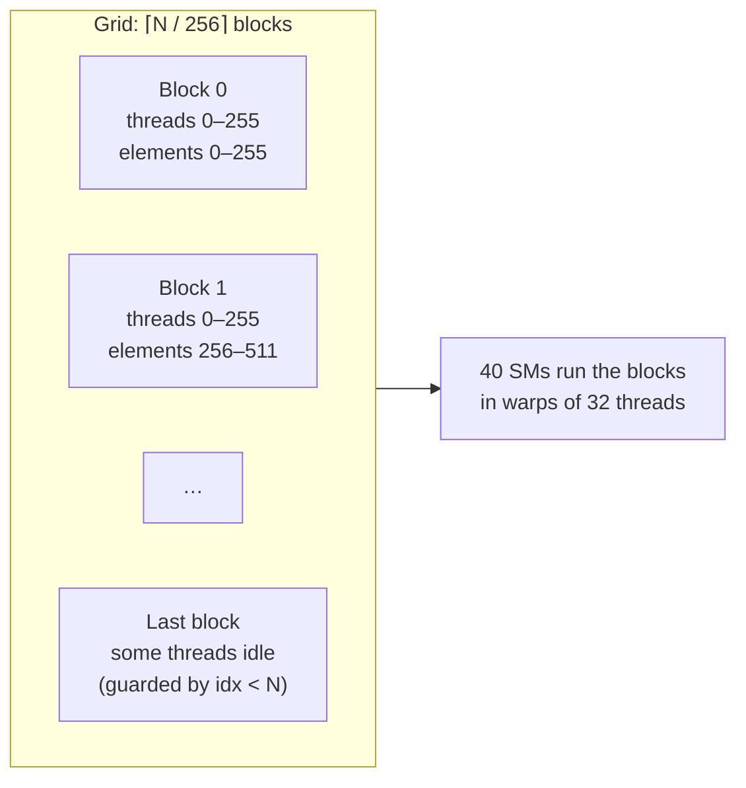
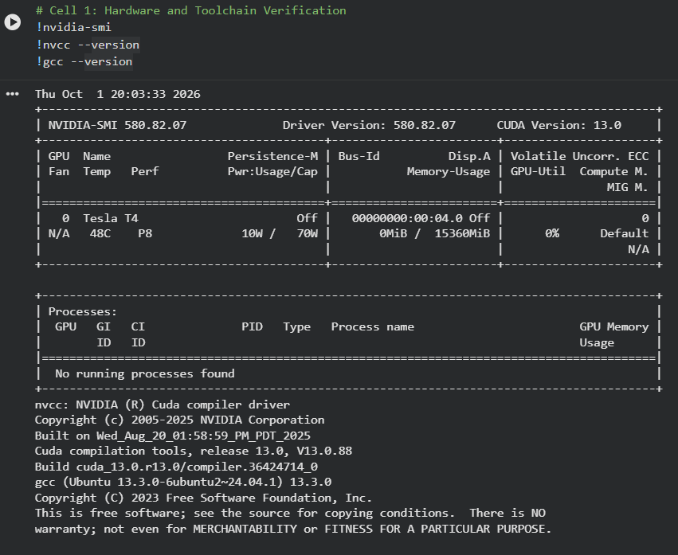
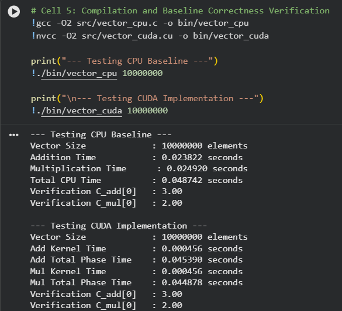
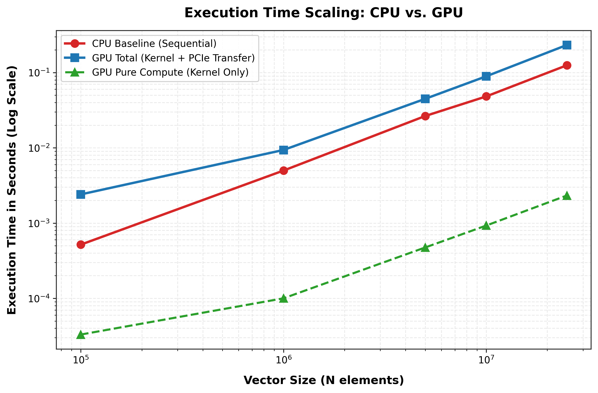
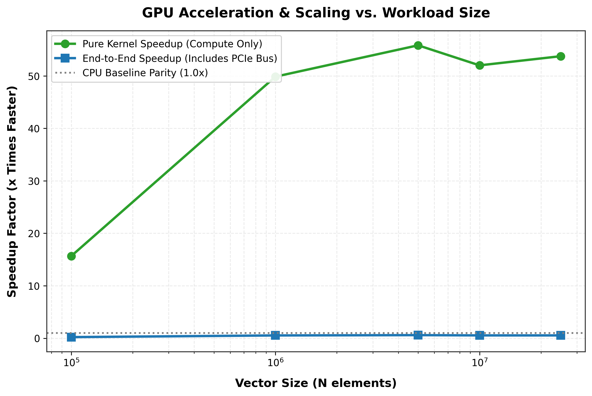
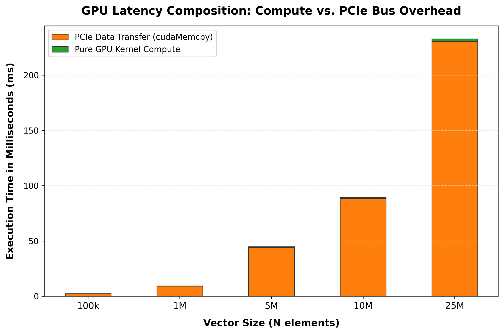
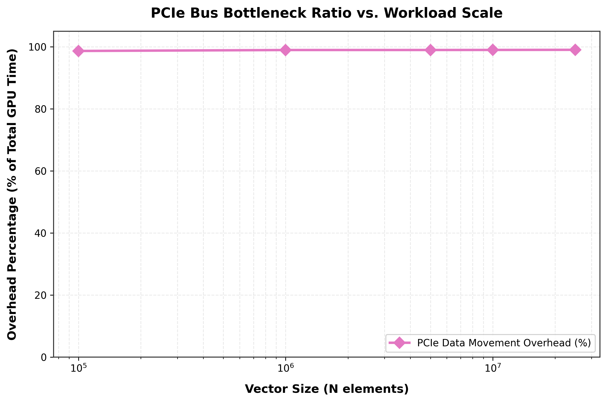
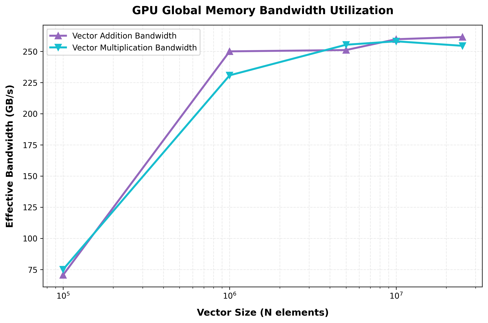
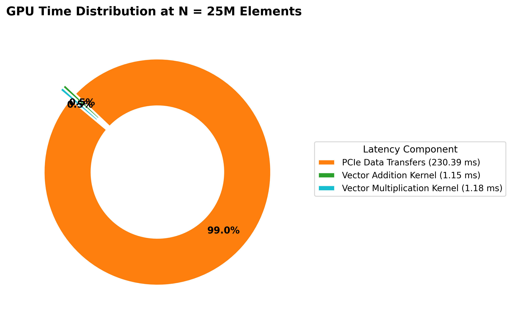

<div align="center">

# GPU Vector Operations using CUDA
### CPU vs GPU Performance of Element-wise Vector Addition and Multiplication on an NVIDIA Tesla T4

**Parallel Computing Lab (PGC) · Mini-Project Lab Evaluation · Theme 7: GPU Vector Operations (CUDA)**


-76B900?logo=nvidia&logoColor=white)


-F9AB00?logo=googlecolab&logoColor=white)


</div>

---

## Abstract

In this project I implemented element-wise **vector addition** ($C = A + B$) and **vector multiplication** ($C = A \times B$) in two ways: a sequential single-core C program on the host CPU, and a parallel CUDA program on an **NVIDIA Tesla T4** GPU (Turing, 2,560 CUDA cores). I ran both programs on Google Colab for five vector sizes, from $N = 10^5$ to $N = 2.5 \times 10^7$ elements. For the GPU, I measured two times separately with CUDA event timers: the **pure kernel time** (computation only) and the **end-to-end phase time** (copy to GPU + kernel + copy back).

My results show two very different pictures of the same program:

- **Kernel only:** the GPU was **49.9×–55.8× faster** than one CPU core for $N \ge 10^6$. The kernels moved data at **≈ 258 GB/s, about 80 % of the T4's 320 GB/s memory bandwidth**.
- **End to end:** once the PCIe copies are counted, the GPU was **slower than the CPU at every size (0.22×–0.59×)**. Data transfer took **98.6 %–99.0 %** of all GPU time.

Both programs produced exactly the expected results (`C_add = 3.00`, `C_mul = 2.00`). I explain these results with **arithmetic intensity** (1 FLOP per 12 bytes, so the work is memory-bound), the **roofline model**, and **Amdahl's law** (even an infinitely fast kernel could reach at most 0.54× end to end at $N = 2.5 \times 10^7$), and I end with concrete ways to remove the transfer bottleneck.

---

## Table of Contents

1. [Introduction](#1-introduction)
2. [Aim and Objectives](#2-aim-and-objectives)
3. [Basic Concepts and Formulas](#3-basic-concepts-and-formulas)
4. [Experimental Setup](#4-experimental-setup)
5. [Methodology and Workflow](#5-methodology-and-workflow)
6. [Checkpoint 1 — Problem Definition, Sequential Algorithm and Parallel Design](#6-checkpoint-1--problem-definition-sequential-algorithm-and-parallel-design)
7. [Checkpoint 2 — Working CUDA Implementation](#7-checkpoint-2--working-cuda-implementation)
8. [Checkpoint 3 — Runs with Different Data Sizes](#8-checkpoint-3--runs-with-different-data-sizes)
9. [Consolidated Results](#9-consolidated-results)
10. [Checkpoint 4 — Performance Analysis with Graphs](#10-checkpoint-4--performance-analysis-with-graphs)
11. [Comparison and Discussion](#11-comparison-and-discussion)
12. [Checkpoint 5 — Live Demonstration](#12-checkpoint-5--live-demonstration)
13. [Glossary](#13-glossary)
14. [Conclusion](#14-conclusion)
15. [Repository Structure and How to Reproduce](#15-repository-structure-and-how-to-reproduce)
16. [References](#16-references)

---

## 1. Introduction

A modern CPU core is very good at running one stream of instructions quickly. A GPU takes the opposite approach: it runs **thousands of simple threads at the same time**. Operations where every output element can be computed independently, such as adding two vectors, look like a perfect fit for a GPU.

There is a catch. A discrete GPU has its **own memory**. Before the GPU can work, the input data must be copied from the host's RAM to the GPU's memory over the **PCIe bus**, and the results must be copied back. For a very light operation like vector addition (one addition per element), this copying can cost much more time than the computation itself.

In this project I measured both sides of that trade-off on real hardware. I set out to answer three questions:

1. How much faster is the CUDA **kernel** than a sequential CPU loop?
2. How much of that advantage survives once **data transfer** is included?
3. **Why** do the numbers look the way they do, and what would change them?

---

## 2. Aim and Objectives

**Aim** (Theme 7 of the mini-project list): *Perform vector addition/multiplication using CUDA threads and compare CPU/GPU execution.*

**Objectives:**

| # | Objective | Checkpoint |
|:-:|:--|:-:|
| 1 | Define the problem formally, write the sequential algorithm, and design the parallel (SIMT) mapping of threads to elements | CP1 |
| 2 | Implement working CUDA kernels for addition and multiplication, with correct memory management and accurate GPU timing | CP2 |
| 3 | Run the CPU and GPU programs for five data sizes and collect the timings in a CSV file | CP3 |
| 4 | Plot execution time, speedup, throughput, bandwidth and transfer overhead; analyse speedup and efficiency | CP4 |
| 5 | Demonstrate the build, the run and the results live | CP5 |

### 2.1 Team

| Sl. No. | Name | USN / Roll Number |
|:-:|:--|:--|
| 1 | Adarsh Walad | 01fe24bci |
| 2 | Nilaksha Nath | 01fe24bci087 |
| 3 | Bachu venkata siva jaideep | 01fe24bci084 |
| 4 | Prathamesh Eedigi | 01fe24bci006 |

---

## 3. Basic Concepts and Formulas

### 3.1 Key CUDA terms

| Term | Meaning | In this project |
|:--|:--|:--|
| **Host / Device** | The CPU with its RAM / the GPU with its own memory | Colab VM CPU / Tesla T4 |
| **Kernel** | A function that runs on the GPU, launched with `<<<grid, block>>>` | `vectorAddKernel`, `vectorMulKernel` |
| **Thread** | One instance of the kernel; here, one thread handles one element | `idx = blockIdx.x * blockDim.x + threadIdx.x` |
| **Block** | A group of threads scheduled together on one SM | 256 threads per block |
| **Grid** | All the blocks of one kernel launch | $\lceil N / 256 \rceil$ blocks |
| **Warp** | 32 threads that execute the same instruction together (SIMT) | 8 warps per block |
| **SM** | Streaming Multiprocessor: the GPU's processing unit | T4 has 40 SMs × 64 cores = 2,560 cores |
| **Global memory** | The GPU's main memory (GDDR6 on the T4) | `cudaMalloc` buffers `d_A`, `d_B`, `d_C` |
| **PCIe** | The bus that connects the GPU card to the host | All `cudaMemcpy` traffic goes over it |
| **CUDA event** | A timestamp recorded by the GPU itself | Used to time the kernel and each phase |

### 3.2 Performance metrics

Let $T_{\text{CPU}}$ be the CPU time for both operations, $T_K$ the sum of the two kernel times, and $T_G$ the sum of the two end-to-end GPU phase times.

| Metric | Formula | Meaning |
|:--|:--|:--|
| PCIe transfer time | $T_X = T_G - T_K$ | Time spent copying data, not computing |
| Kernel speedup | $S_{\text{kernel}} = T_{\text{CPU}} / T_K$ | How much faster the GPU computation is |
| End-to-end speedup | $S_{\text{e2e}} = T_{\text{CPU}} / T_G$ | How much faster the GPU is once copies are included |
| Throughput | $\text{GFLOPS} = 2N / (T \cdot 10^9)$ | Floating-point operations per second (1 add + 1 multiply per element) |
| Effective bandwidth | $BW = 12N / (T_{\text{kernel}} \cdot 10^9)$ GB/s, per operation | Bytes moved per second (read A, read B, write C: 3 × 4 bytes) |
| PCIe overhead | $O = 100 \cdot T_X / T_G$ % | Share of GPU time spent on copying |
| Parallel efficiency | $E = S / P$ | Speedup per processing element |
| Arithmetic intensity | $AI = \text{FLOPs} / \text{bytes}$ | Work done per byte of memory traffic |
| Roofline bound | $P_{\text{max}} = \min(P_{\text{peak}},\ AI \times BW_{\text{peak}})$ | Best possible FLOP rate for a given AI |
| Amdahl's law | $S_{\max} = T_{\text{CPU}} / T_X$ when $T_K \to 0$ | Upper limit when the copy part cannot be sped up |

---

## 4. Experimental Setup

I ran the whole experiment on **Google Colab** with the **T4 GPU** runtime. The software versions and GPU details below are taken from the toolchain check I ran at the start of the session (screenshot 01). Values marked *datasheet* are NVIDIA's published specifications for the T4, which I use in the analysis.

| Item | What I used |
|:--|:--|
| Platform | Google Colab VM, Ubuntu 24.04 |
| GPU | **NVIDIA Tesla T4**, 15,360 MiB memory; idle at 48 °C, power state P8, 10 W of 70 W before the run |
| GPU architecture | Turing, compute capability 7.5; 40 SMs, 2,560 CUDA cores *(datasheet)* |
| GPU memory bandwidth | 320 GB/s GDDR6 *(datasheet)* |
| GPU peak FP32 | ≈ 8.1 TFLOPS *(datasheet)* |
| Host–GPU link | PCIe Gen3 x16, ≈ 15.75 GB/s per direction *(datasheet)* |
| NVIDIA driver | **580.82.07** (supports CUDA 13.0) |
| CUDA compiler | **NVCC release 13.0, V13.0.88** |
| Host compiler | **GCC 13.3.0** (Ubuntu 13.3.0-6ubuntu2~24.04.1) |
| Compiler flags | `gcc -O2`, `nvcc -O2` |
| Host CPU | Intel Xeon @ 2.20 GHz (Colab VM), 1 core used by the CPU baseline |
| Data sizes | $N$ = 100,000; 1,000,000; 5,000,000; 10,000,000; 25,000,000 |
| Repetitions | 1 run per size |
| Analysis | Python 3, pandas, NumPy, matplotlib |
| Run date | 1 October 2026, 20:03 (Colab clock, screenshot 01) |

---

## 5. Methodology and Workflow

I carried out the complete experiment inside one Colab notebook, [`notebook/pgc_codes.ipynb`](notebook/pgc_codes.ipynb), with the runtime set to **T4 GPU**. Shell commands in a Colab cell are prefixed with `!`, and the `%%writefile` magic saves the contents of a cell as a file on the Colab VM. I ran the ten cells strictly in order, so that every step used the output of the step before it.



**Step-by-step execution:**

| Cell | What I did | Command / tool | Output |
|:-:|:--|:--|:--|
| 1 | Confirmed that the runtime has a GPU and that the CUDA and C compilers are installed, and recorded their versions | `!nvidia-smi`, `!nvcc --version`, `!gcc --version` | Tesla T4, driver 580.82.07, CUDA 13.0, GCC 13.3.0 (screenshot 01) |
| 2 | Created the project folders (`src`, `data`, `results`, `graphs`, `presentation`, `scripts`, `bin`) and initialised a Git repository | `!mkdir -p ...`, `!git init` | Empty project structure |
| 3 | Wrote the sequential CPU baseline | `%%writefile src/vector_cpu.c` | `src/vector_cpu.c` |
| 4 | Wrote the CUDA program: both kernels, memory management, warm-up launch and event timing | `%%writefile src/vector_cuda.cu` | `src/vector_cuda.cu` |
| 5 | Compiled both programs with `-O2` and ran each once at $N = 10^7$ to check correctness before benchmarking | `!gcc -O2 ...`, `!nvcc -O2 ...`, `!./bin/vector_cpu 10000000`, `!./bin/vector_cuda 10000000` | `bin/` binaries; both print 3.00 and 2.00 (screenshot 02) |
| 6 | Wrote a Bash script that runs both programs for the five sizes and extracts the timing lines into a CSV | `%%writefile scripts/run_benchmarks.sh` | `scripts/run_benchmarks.sh` |
| 7 | Made the script executable and ran the benchmark sweep | `!chmod +x ...`, `!./scripts/run_benchmarks.sh` | `results/timing_data.csv` (Section 8.2) |
| 8 | Loaded the CSV with pandas, computed the derived metrics (transfer time, both speedups, GFLOPS, bandwidth, PCIe overhead) and drew Figures 1–8 | pandas, NumPy, matplotlib | `graphs/01` … `graphs/08` |
| 9 | Built the master comparison table as an image | matplotlib table | `graphs/09` |
| 10 | Packed the project into a zip file and downloaded it from Colab | `!zip -r gpu-project.zip ...`, `files.download(...)` | `gpu-project.zip` |

To let the graphs be redrawn without opening the notebook, I exported the plotting code of cells 8 and 9, unchanged, as [`scripts/plot_results.py`](scripts/plot_results.py).

---

## 6. Checkpoint 1 — Problem Definition, Sequential Algorithm and Parallel Design

### 6.1 Problem definition

Let $A, B \in \mathbb{R}^N$ be two single-precision (FP32) vectors. Compute:

$$C_{\text{add}}[i] = A[i] + B[i], \qquad C_{\text{mul}}[i] = A[i] \times B[i], \qquad 0 \le i < N$$

Each output element depends **only** on the two input elements at the same index. There is no data shared between elements, no ordering and no reduction. The problem is therefore **embarrassingly parallel**: all $N$ elements can be computed at the same time with no synchronisation between threads.

### 6.2 Inputs and correctness rule

I fill the inputs the same, fixed way in both programs (no external dataset is needed; see [`data/README.md`](data/README.md)):

$$A[i] = 1.0, \qquad B[i] = 2.0 \qquad \text{for all } i$$

So the correct outputs are known exactly, with no rounding error in FP32:

$$C_{\text{add}}[i] = 3.00, \qquad C_{\text{mul}}[i] = 2.00$$

I count a run as correct only if the program prints `3.00` and `2.00`.

### 6.3 Sequential algorithm (CPU baseline)

```text
Algorithm 1: Sequential vector operations
Input : A[0..N-1], B[0..N-1]
Output: C_add[0..N-1], C_mul[0..N-1]
1: for i ← 0 to N-1 do  C_add[i] ← A[i] + B[i]
2: for i ← 0 to N-1 do  C_mul[i] ← A[i] × B[i]
```

My CPU program (`src/vector_cpu.c`) times each loop separately with `clock()` and reports **Total CPU Time = addition time + multiplication time**. I deliberately kept it on **one core**, with no OpenMP, so that it gives a clean sequential reference $T_1$.

### 6.4 Complexity

| Version | Work $W(N)$ | Span (critical path) $D(N)$ | Time on $P$ processors |
|:--|:-:|:-:|:-:|
| Sequential CPU | $\mathcal{O}(N)$ | $\mathcal{O}(N)$ | $\Theta(N)$ |
| Parallel GPU | $\mathcal{O}(N)$ | $\mathcal{O}(1)$ | $\mathcal{O}(N/P + 1)$ (Brent's theorem) |

Each GPU thread does exactly one operation, so the critical path is one step long. The total work is the same $\mathcal{O}(N)$ as in the sequential version, so the parallel algorithm is **work-efficient**. In practice, as I show in Section 11.1, the GPU time is limited by memory bandwidth, not by the number of cores.

### 6.5 Parallel design: mapping threads to elements

I designed the kernel so that **one thread computes one element**. The GPU launches a grid of blocks, each with 256 threads, and each thread finds its element with:

$$\text{idx} = \text{blockIdx.x} \times \text{blockDim.x} + \text{threadIdx.x}$$

*Example:* thread 17 in block 3 (with 256 threads per block) handles element $3 \times 256 + 17 = 785$.



### 6.6 Why I chose 256 threads per block

$$256 \text{ threads} = 8 \text{ warps} \times 32 \text{ threads}$$

1. **No wasted lanes.** 256 is a multiple of 32, so every warp is full.
2. **Full occupancy.** A Turing SM can hold at most 1,024 threads (32 warps) and 16 blocks. Four blocks of 256 fill it completely, so the SM always has other warps to run while some wait for memory.
3. **Small blocks would limit occupancy.** With 32-thread blocks, the 16-block limit would allow only 512 threads per SM (50 %).
4. **Very large blocks are less flexible.** A 1,024-thread block fills a whole SM by itself, which makes the last, partly filled "wave" of blocks less efficient.

256 is also NVIDIA's usual recommendation for simple memory-streaming kernels.

### 6.7 Grid size and the boundary guard

The number of blocks must cover all $N$ elements, so I round it up:

$$\text{blocksPerGrid} = \left\lceil \frac{N}{256} \right\rceil = \frac{N + 255}{256} \ \text{(integer division)}$$

This usually launches a few more threads than there are elements. Those extra threads must do nothing, or they would read and write past the end of the arrays. That is why every kernel starts with `if (idx < n)`.

| $N$ | Blocks | Threads launched | Extra (guarded) threads | Waves on the T4 (160 blocks at a time) |
|--:|--:|--:|--:|--:|
| 100,000 | 391 | 100,096 | 96 | ≈ 2.4 |
| 1,000,000 | 3,907 | 1,000,192 | 192 | ≈ 24.4 |
| 5,000,000 | 19,532 | 5,000,192 | 192 | ≈ 122.1 |
| 10,000,000 | 39,063 | 10,000,128 | 128 | ≈ 244.1 |
| 25,000,000 | 97,657 | 25,000,192 | 192 | ≈ 610.4 |

"160 blocks at a time" = 40 SMs × 4 resident blocks of 256 threads.

---

## 7. Checkpoint 2 — Working CUDA Implementation

### 7.1 The kernels (`src/vector_cuda.cu`)

```cuda
__global__ void vectorAddKernel(const float *A, const float *B, float *C, long n) {
    long idx = blockIdx.x * blockDim.x + threadIdx.x;
    if (idx < n) {
        C[idx] = A[idx] + B[idx];
    }
}

__global__ void vectorMulKernel(const float *A, const float *B, float *C, long n) {
    long idx = blockIdx.x * blockDim.x + threadIdx.x;
    if (idx < n) {
        C[idx] = A[idx] * B[idx];
    }
}
```

- `__global__` marks a function that runs on the GPU and is launched from the host.
- Each thread computes its own `idx` and handles exactly one element.
- I declared the inputs `const`, so the kernel only reads them.

### 7.2 Memory life cycle

```text
 HOST (RAM, malloc)                         PCIe bus                          DEVICE (GDDR6, cudaMalloc)
 h_A, h_B, h_C_add, h_C_mul                                                   d_A, d_B, d_C
 fill A[i]=1, B[i]=2
 h_A, h_B  ───── cudaMemcpy(HostToDevice) ────────────────────────────────▶   d_A, d_B
                                                                              kernel<<<blocks, 256>>>
 h_C_add   ◀──── cudaMemcpy(DeviceToHost) ─────────────────────────────────   d_C
 free(...)                                                                    cudaFree(...)
```

| Step | CUDA call | Purpose |
|:--|:--|:--|
| Allocate | `cudaMalloc(&d_A, bytes)` | Reserve GPU memory for A, B and one output C |
| Copy in | `cudaMemcpy(d_A, h_A, bytes, cudaMemcpyHostToDevice)` | Send inputs over PCIe |
| Compute | `vectorAddKernel<<<blocksPerGrid, 256>>>(...)` | Launch $\lceil N/256 \rceil$ blocks |
| Copy out | `cudaMemcpy(h_C_add, d_C, bytes, cudaMemcpyDeviceToHost)` | Bring the result back (waits for the kernel to finish) |
| Free | `cudaFree`, `free`, `cudaEventDestroy` | Release GPU memory, host memory and timers |

I reuse one output buffer `d_C` for both operations, so the GPU needs $3 \times 4N$ bytes (286 MiB at $N = 2.5 \times 10^7$).

### 7.3 Timing with CUDA events

I time each operation as one **phase**, with two pairs of events:

```text
totalStart ─┬─ copy A in ─ copy B in ─┬─ kernelStart ─ KERNEL ─ kernelStop ─┬─ copy C out ─┬─ totalStop
            │                         └──────── pure kernel time ──────────┘              │
            └────────────────────────────── end-to-end phase time ─────────────────────────┘
```

- `kernelStart → kernelStop` gives the **pure kernel time** (no PCIe).
- `totalStart → totalStop` gives the **end-to-end phase time** (copy in + kernel + copy out).
- CUDA events are timestamped **by the GPU**, so they measure what the GPU actually did. A normal CPU timer around a kernel launch would only measure the few microseconds the CPU needs to *queue* the launch, because launches are asynchronous.
- `cudaEventSynchronize(stop)` makes the CPU wait until the GPU has reached the stop event, so the elapsed time can be read safely.

### 7.4 Warm-up launch

```c
// --- WARM-UP (Wakes up the GPU & initializes CUDA driver context) ---
vectorAddKernel<<<blocksPerGrid, threadsPerBlock>>>(d_A, d_B, d_C, N);
cudaDeviceSynchronize();
```

The first CUDA work in a program pays one-time costs:

1. **Creating the CUDA context** (setting up the driver and the GPU address space).
2. **Loading the kernel code** onto the GPU.
3. **Raising the GPU clocks** from its idle power state. Screenshot 01 shows the T4 idle in state **P8 at 10 W**.

These costs are far larger than the 16 µs–1.2 ms kernels I measure. I added one untimed launch, followed by `cudaDeviceSynchronize()`, to absorb them **before** any timer starts, so the recorded times show the steady-state speed. The warm-up result is thrown away.

> **Toolkit note.** CUDA 13.0 compiles for Turing (`sm_75`) by default, which matches the T4, so `nvcc -O2` gave **no architecture warning** (screenshot 02). Adding `-arch=sm_75` would state the target explicitly.

### 7.5 Build and correctness check

```bash
gcc  -O2 src/vector_cpu.c   -o bin/vector_cpu
nvcc -O2 src/vector_cuda.cu -o bin/vector_cuda
./bin/vector_cpu  10000000
./bin/vector_cuda 10000000
```

The output I recorded at $N = 10^7$ (screenshot 02):

```text
--- Testing CPU Baseline ---
Vector Size             : 10000000 elements
Addition Time           : 0.023822 seconds
Multiplication Time      : 0.024920 seconds
Total CPU Time          : 0.048742 seconds
Verification C_add[0]   : 3.00
Verification C_mul[0]   : 2.00

--- Testing CUDA Implementation ---
Vector Size             : 10000000 elements
Add Kernel Time         : 0.000456 seconds
Add Total Phase Time    : 0.045390 seconds
Mul Kernel Time         : 0.000456 seconds
Mul Total Phase Time    : 0.044878 seconds
Verification C_add[0]   : 3.00
Verification C_mul[0]   : 2.00
```

Both programs print the expected `3.00` and `2.00`, so the CUDA implementation compiles, runs and gives correct results.

### 7.6 Screenshots

| | |
|:-:|:-:|
| <br><em>01 — Toolchain check: <code>nvidia-smi</code> (Tesla T4, driver 580.82.07), <code>nvcc</code> 13.0, <code>gcc</code> 13.3.0</em> | <br><em>02 — Compilation and correctness check at N = 10<sup>7</sup>: both programs print 3.00 and 2.00</em> |

---

## 8. Checkpoint 3 — Runs with Different Data Sizes

### 8.1 Benchmark script (`scripts/run_benchmarks.sh`)

```bash
SIZES=(100000 1000000 5000000 10000000 25000000)
for N in "${SIZES[@]}"; do
    CPU_OUT=$(./bin/vector_cpu $N)
    CPU_TIME=$(echo "$CPU_OUT" | grep "Total CPU Time" | awk '{print $5}')
    GPU_OUT=$(./bin/vector_cuda $N)
    GPU_ADD_K=$(echo "$GPU_OUT" | grep "Add Kernel Time" | awk '{print $5}')
    ...
    echo "$N,$CPU_TIME,$GPU_ADD_K,$GPU_ADD_TOT,$GPU_MUL_K,$GPU_MUL_TOT" >> results/timing_data.csv
done
```

For each of the five sizes, my script runs both programs, picks the timing lines out of their output with `grep` and `awk`, and appends one row to the CSV. I chose sizes that span **2.5 orders of magnitude** (250× from smallest to largest), from a vector that fits easily in cache (0.4 MB per vector) to one of 100 MB per vector.

### 8.2 Raw measurements (`results/timing_data.csv`, seconds)

| N | CPU_Total_Time | GPU_Add_Kernel | GPU_Add_Total | GPU_Mul_Kernel | GPU_Mul_Total |
|--:|--:|--:|--:|--:|--:|
| 100,000 | 0.000517 | 0.000017 | 0.000629 | 0.000016 | 0.001775 |
| 1,000,000 | 0.004986 | 0.000048 | 0.004704 | 0.000052 | 0.004661 |
| 5,000,000 | 0.026466 | 0.000239 | 0.022191 | 0.000235 | 0.022584 |
| 10,000,000 | 0.048217 | 0.000462 | 0.044393 | 0.000465 | 0.044835 |
| 25,000,000 | 0.125050 | 0.001147 | 0.114269 | 0.001179 | 0.118446 |

**Repeatability check.** The correctness run (screenshot 02) and the benchmark row for $N = 10^7$ came from the same Colab session but were separate runs. They agree closely: CPU 48.742 ms vs 48.217 ms (1.1 % apart), add kernel 0.456 ms vs 0.462 ms (1.3 % apart).

---

## 9. Consolidated Results

### 9.1 Master table

All times are in milliseconds. GPU times are the sum of the addition and multiplication phases. Memory footprint is the GPU working set, $3 \times 4N$ bytes.

| $N$ | GPU memory (MiB) | CPU (ms) | GPU kernel (ms) | GPU end-to-end (ms) | Kernel speedup | End-to-end speedup | Kernel GFLOPS | Kernel bandwidth (GB/s) | PCIe overhead | Result |
|--:|--:|--:|--:|--:|--:|--:|--:|--:|--:|:-:|
| 100,000 | 1.14 | 0.517 | 0.033 | 2.404 | 15.67× | 0.215× | 6.06 | 72.7 | 98.63 % | PASSED |
| 1,000,000 | 11.44 | 4.986 | 0.100 | 9.365 | 49.86× | 0.532× | 20.00 | 240.0 | 98.93 % | PASSED |
| 5,000,000 | 57.22 | 26.466 | 0.474 | 44.775 | **55.84×** | **0.591×** | 21.10 | 253.2 | 98.94 % | PASSED |
| 10,000,000 | 114.44 | 48.217 | 0.927 | 89.228 | 52.01× | 0.540× | **21.57** | **258.9** | 98.96 % | PASSED |
| 25,000,000 | 286.10 | 125.050 | 2.326 | 232.715 | 53.76× | 0.537× | 21.50 | 258.0 | 99.00 % | PASSED |

"PASSED" means `C_add[0] = 3.00` and `C_mul[0] = 2.00`. My benchmark script saves only the timing lines, so for the sweep the correctness evidence is the verification run (screenshot 02); I used the same binaries for all sizes.

### 9.2 Per-operation breakdown

| $N$ | Add kernel (ms) | Add phase (ms) | Mul kernel (ms) | Mul phase (ms) | Add BW (GB/s) | Mul BW (GB/s) | Transfer $T_X$ (ms) | Effective PCIe rate (GB/s) |
|--:|--:|--:|--:|--:|--:|--:|--:|--:|
| 100,000 | 0.017 | 0.629 | 0.016 | 1.775 | 70.6 | 75.0 | 2.371 | 1.01 |
| 1,000,000 | 0.048 | 4.704 | 0.052 | 4.661 | 250.0 | 230.8 | 9.265 | 2.59 |
| 5,000,000 | 0.239 | 22.191 | 0.235 | 22.584 | 251.0 | 255.3 | 44.301 | 2.71 |
| 10,000,000 | 0.462 | 44.393 | 0.465 | 44.835 | 259.7 | 258.1 | 88.301 | 2.72 |
| 25,000,000 | 1.147 | 114.269 | 1.179 | 118.446 | 261.6 | 254.5 | 230.389 | 2.60 |

Effective PCIe rate = $24N$ bytes (per phase: two $4N$-byte uploads and one $4N$-byte download; two phases) ÷ $T_X$.

### 9.3 Efficiency

For a GPU, "speedup ÷ number of cores" on its own is misleading, so I report three measures of efficiency (at $N = 2.5 \times 10^7$):

| Efficiency measure | Calculation | Value | What it tells me |
|:--|:--|--:|:--|
| Per-core parallel efficiency | $E = S_{\text{kernel}} / P = 53.76 / 2{,}560$ | 2.10 % | Low by nature: the cores mostly wait for memory, they are not the limit |
| Memory-bandwidth efficiency | $258.0 / 320$ GB/s | **80.6 %** | High: real streaming kernels usually reach 80–90 % of peak |
| Roofline efficiency | $21.50 / 26.67$ GFLOPS | **80.6 %** | The kernel reaches 80.6 % of the best FLOP rate its memory traffic allows |

For a memory-bound kernel like mine, **bandwidth efficiency is the meaningful measure**. Per-core efficiency would matter only if the work were limited by computation.

### 9.4 Key numbers

| Measure | Value |
|:--|:--|
| Peak kernel speedup | **55.84×** at $N = 5 \times 10^6$ (49.9×–55.8× for $N \ge 10^6$) |
| End-to-end speedup | **0.215×–0.591×** (GPU slower at every size) |
| Kernel memory bandwidth | **≈ 258 GB/s** at $N \ge 10^7$ (80.6 % of 320 GB/s) |
| Kernel throughput | **21.5 GFLOPS** (plateau) |
| PCIe share of GPU time | **98.6 %–99.0 %** |
| Correctness | 3.00 / 2.00 on CPU and GPU |

---

## 10. Checkpoint 4 — Performance Analysis with Graphs

I generated all figures from `results/timing_data.csv` with the plotting code in the notebook (cells 8–9, also saved as `scripts/plot_results.py`), with no manual editing. In Figs. 1, 2, 3, 5 and 6 the x-axis is **logarithmic**, so each step of 10× in $N$ takes the same width.

### 10.1 Fig. 1 — Execution time vs vector size

<p align="center"></p>

**What the graph shows:**
- Both axes are logarithmic, so a straight line with slope 1 means time grows in proportion to $N$. The **CPU** line (red) has slope ≈ 1: $N$ grows 250× and CPU time grows 241.9× (0.517 → 125.05 ms). This confirms the $\Theta(N)$ sequential cost.
- The **GPU kernel** line (green, dashed) is 1.2–1.7 orders of magnitude **below** the CPU. Between $10^5$ and $10^6$ it is flatter (time grows only 3.0× for 10× more data): with only 391 blocks (≈ 2.4 waves) the GPU is not yet full, and fixed launch cost dominates. From $10^6$ on it grows linearly.
- The **GPU end-to-end** line (blue) is **above** the CPU line at every size, so there is **no crossover** in the measured range. The gap is largest at $10^5$ (4.6× slower) and settles at about 1.7–1.9× slower for $N \ge 10^6$. Because both lines then run parallel (both slope 1), a larger $N$ would **not** create a crossover.

### 10.2 Fig. 2 — Speedup: kernel vs end-to-end

<p align="center"></p>

**What the graph shows:**
- **Kernel speedup** (green) rises from 15.7× at $10^5$ to 49.9× at $10^6$, peaks at **55.8×** at $5 \times 10^6$, and stays at 52–54× after that. The flat top is the sign of a memory-bound task: once both sides stream memory at full speed, the speedup equals the ratio of their memory bandwidths, $258.0 / 4.80 \approx 53.8$.
- **End-to-end speedup** (blue) stays **below the 1.0× line** at every size: 0.215× at $10^5$, then 0.53×–0.59×. On this linear y-axis it looks flat near zero; the exact values are in Section 9.1.
- The same program is therefore "54× faster" or "1.9× slower" depending on what is measured. I explain why with Amdahl's law in Section 11.2.

### 10.3 Fig. 3 — Computational throughput (GFLOPS)

<p align="center"></p>

**What the graph shows:**
- GPU kernel throughput climbs from 6.1 GFLOPS ($10^5$) to 20.0 GFLOPS ($10^6$) and levels off at **21.1–21.6 GFLOPS**.
- That is only 0.27 % of the T4's 8.1 TFLOPS peak. This is **not** poor code: for this kernel the roofline limit is $AI \times BW = (1/12) \times 320 = 26.7$ GFLOPS, and 21.5 GFLOPS is **80.6 %** of that limit.
- The CPU stays flat at 0.38–0.41 GFLOPS, and the GPU end-to-end rate is even lower (0.08–0.22 GFLOPS) because transfer time is included. Both lines sit close to zero on this scale.

### 10.4 Fig. 4 — GPU time split: transfer vs kernel

<p align="center"></p>

**What the graph shows:**
- Each bar is the total GPU time, split into **PCIe transfer** (orange) and **kernel** (green). The green part is a thin line on top of each bar: at $N = 2.5 \times 10^7$, 2.3 ms of kernel on top of 230.4 ms of transfer.
- Transfer time grows in proportion to $N$ (2.4 → 9.3 → 44.3 → 88.3 → 230.4 ms). It is a cost per byte, not a fixed delay that larger problems could hide.
- Even a kernel that took **zero** time would shorten these bars by less than 1.1 %.

### 10.5 Fig. 5 — PCIe overhead percentage

<p align="center"></p>

**What the graph shows:**
- The share of GPU time spent copying is almost constant: 98.63 %, 98.93 %, 98.94 %, 98.96 %, **99.00 %**.
- It is flat because both transfer time and kernel time grow in proportion to $N$, so $N$ cancels out in their ratio (derivation in Section 11.2). The overhead is a property of this workload on this machine, not of the problem size.

### 10.6 Fig. 6 — Effective GPU memory bandwidth

<p align="center"></p>

**What the graph shows:**
- At $10^5$ the kernels reach only 71–75 GB/s: too few threads are running to keep enough memory requests in flight.
- From $10^6$ on, bandwidth jumps to 231–250 GB/s and then **levels off at 251–262 GB/s** (≈ 258 GB/s at the two largest sizes). That is **≈ 80 % of the T4's 320 GB/s** — about the practical ceiling for any streaming kernel, because DRAM refresh and switching between reads and writes cost some time.
- Addition (purple) and multiplication (cyan) stay within ±3 % of each other. This is expected: both move exactly 12 bytes per element, and an FP32 add costs the same as an FP32 multiply.
- **The flat top shows that the memory bus is saturated.** More data makes the kernel take longer but cannot raise bytes per second.

### 10.7 Fig. 7 — GPU time distribution at N = 25 M

<p align="center"></p>

**What the graph shows:** at the largest size (286 MiB on the GPU), the 232.7 ms of GPU time splits into:

| Part | Time (ms) | Share |
|:--|--:|--:|
| PCIe transfers (in and out, both phases) | 230.389 | 99.0 % |
| Addition kernel | 1.147 | 0.5 % |
| Multiplication kernel | 1.179 | 0.5 % |

In simple words: **99 of every 100 milliseconds are spent moving data**; less than 1 % is spent computing. (The two small "0.5 %" labels overlap in the figure; the exact values are in this table and in the figure's legend.)

### 10.8 Fig. 8 — Performance dashboard

<p align="center"></p>

**What the graph shows:** the four main views side by side: run time (top-left), speedup (top-right), GFLOPS (bottom-left) and memory bandwidth (bottom-right). Read together they tell one story: the kernel **fills the memory bus** (bottom-right), so throughput and speedup **level off** (bottom-left, top-right), and the PCIe copies, about 100× longer than the kernel, make the end-to-end GPU time **worse than the CPU** (top-left).

### 10.9 Fig. 9 — Master comparison table

<p align="center"></p>

**What the figure shows:** the master table of Section 9.1 as one image, with the kernel speedup (green), end-to-end speedup (blue) and PCIe overhead (orange) highlighted. All values match the CSV. I drew this figure before finishing the analysis, so three points in its text should be read as follows:

- The "Memory Footprint" column says MB, but the values are in **MiB** ($3 \times 4N / 2^{20}$).
- The footnote calls the ≈ 50× kernel speedup "arithmetic acceleration across 2,560 CUDA cores". My analysis in Section 11.1 shows that it actually comes from the GPU's **higher memory bandwidth**.
- The footnote gives the end-to-end range as "~0.5×–0.8×". The measured range is **0.215×–0.591×**, and the Amdahl limit at 25 M is 0.543×.

---

## 11. Comparison and Discussion

### 11.1 Why the kernel is memory-bound: arithmetic intensity and the roofline

For each element of each operation, the kernel reads 8 bytes (`A[i]`, `B[i]`), writes 4 bytes (`C[i]`) and does **1** floating-point operation:

$$AI = \frac{1\ \text{FLOP}}{12\ \text{bytes}} \approx 0.083\ \text{FLOP/byte}$$

The T4 can do about 8.1 TFLOP/s but can move only 320 GB/s. The **ridge point** — the arithmetic intensity at which a kernel stops being limited by memory — is:

$$AI_{\text{ridge}} = \frac{8.1 \times 10^{12}}{320 \times 10^{9}} \approx 25.3\ \text{FLOP/byte}$$

My kernels are **≈ 304× below** the ridge point, so their speed is set entirely by memory bandwidth. The roofline limit is $0.083 \times 320 = 26.7$ GFLOPS, and I measured 21.5 GFLOPS (80.6 %). More cores, faster arithmetic or clever instruction tricks would not help; only moving fewer bytes would.

The same reasoning explains the **kernel speedup**. The CPU core streams data at about $24N / T_{\text{CPU}} \approx 4.8$ GB/s; the GPU at ≈ 258 GB/s. Their ratio, $258 / 4.8 \approx 54$, matches the measured kernel speedup at $N = 2.5 \times 10^7$ (53.76×).

### 11.2 Why the GPU loses end to end: PCIe and Amdahl's law

| Data path | Theoretical | Measured in my run |
|:--|--:|--:|
| GPU cores ↔ GPU memory (GDDR6) | 320 GB/s | **≈ 258 GB/s** |
| Host RAM ↔ GPU (PCIe Gen3 x16) | ≈ 15.75 GB/s per direction (≈ 12 GB/s typical with pinned memory) | **≈ 2.6 GB/s** |

In my run the copy path was about **99× slower** than the GPU's own memory. If I treat the copy as the part that cannot be sped up and the kernel as the part that can, **Amdahl's law** says that even an infinitely fast kernel ($T_K \to 0$) gives at most:

$$S_{\text{e2e}}^{\max} = \frac{T_{\text{CPU}}}{T_X} = \frac{125.050\ \text{ms}}{230.389\ \text{ms}} = 0.543\times \qquad (N = 2.5 \times 10^7)$$

I measured **0.537×**, already within 1.1 % of this limit. **Copying the data alone took 1.84× longer than the whole CPU computation**, so no GPU, however fast, could win on this isolated task.

The overhead fraction is also easy to derive. With $24N$ bytes copied and $24N$ bytes processed on the GPU:

$$O_{\text{PCIe}} = \frac{T_X}{T_X + T_K} = \frac{1}{1 + BW_{\text{PCIe}} / BW_{\text{GPU}}} = \frac{1}{1 + 2.60 / 258} \approx 99.0\,\%$$

$N$ cancels completely, which is why Fig. 5 is flat. Even with ideal pinned transfers (12 GB/s) the overhead would still be $1 / (1 + 12/258) \approx 95.6\,\%$.

**Why my measured PCIe rate (≈ 2.6 GB/s) is far below 12 GB/s:**

1. **Pageable host memory.** I allocated the host arrays with `malloc`, which gives memory the OS can move or swap. The GPU's copy engine cannot read it directly, so the driver first copies it into a hidden pinned buffer and then sends that buffer: an extra copy for every transfer.
2. **First-touch page faults.** The output buffers `h_C_add` and `h_C_mul` are never written before the copy back, so every 4 KiB page is created by the OS *during* the timed copy.
3. **Virtualised cloud host.** Colab is a virtual machine; DMA goes through extra address translation.

**Estimate, not measured:** with pinned memory at ≈ 12 GB/s, the transfer at 25 M would take about 600 MB ÷ 12 GB/s = 50 ms, so $S_{\text{e2e}} \approx 125.05 / (50 + 2.33) \approx 2.4\times$. Switching to `cudaMallocHost` could therefore plausibly make the GPU faster than the CPU end to end.

### 11.3 Memory coalescing

The 32 threads of a warp have consecutive `idx` values, so they read 32 consecutive floats: $32 \times 4 = 128$ bytes, one aligned memory segment. The GPU combines these 32 requests into the minimum number of memory transactions (**coalescing**), and every byte fetched is used. With a strided pattern (for example `A[t * 32]`), each thread would touch a different segment, most fetched bytes would be wasted, and bandwidth would drop sharply. The measured 80.6 % bandwidth efficiency is direct evidence that my simple indexing coalesces fully.

### 11.4 CPU vs GPU kernel vs GPU end to end

| | CPU (1 core) | GPU kernel only | GPU end to end |
|:--|:--|:--|:--|
| Time at $N = 2.5 \times 10^7$ | 125.05 ms | 2.33 ms | 232.72 ms |
| Relative to CPU | 1.00× | **53.76× faster** | **1.86× slower** |
| Limited by | One core's memory streaming (≈ 4.8 GB/s) | GPU memory bandwidth (≈ 258 GB/s) | PCIe copies (≈ 2.6 GB/s) |
| When it is the right choice | Small, one-off element-wise jobs | Data already on the GPU | Only if many operations reuse the same transferred data |

**Addition vs multiplication.** The two kernels took practically the same time at every size (for example 1.147 vs 1.179 ms at 25 M), because both move the same 12 bytes per element and are limited by memory, not by the operation.

### 11.5 Observations on the CPU baseline

- One core streamed only ≈ 4.5–5.0 GB/s. Part of the reason is the same first-touch effect: `C_add` and `C_mul` pages are created inside the timed loops.
- I kept the baseline single-threaded on purpose, to get a clean $T_1$. A multi-threaded (OpenMP) or AVX-vectorised CPU version would reduce the kernel speedup but would not change the main conclusion.

---

## 12. Checkpoint 5 — Live Demonstration

I demonstrate the project live on Google Colab, following the same order as my notebook.

1. **Select the GPU runtime.** In Colab, I choose **Runtime → Change runtime type → T4 GPU** and open `notebook/pgc_codes.ipynb` (or upload `src/` and `scripts/`).
2. **Show the hardware and toolchain** (as in screenshot 01):
   ```bash
   !nvidia-smi
   !nvcc --version
   !gcc --version
   ```
3. **Compile and check correctness** (as in screenshot 02):
   ```bash
   !mkdir -p bin
   !gcc  -O2 src/vector_cpu.c   -o bin/vector_cpu
   !nvcc -O2 src/vector_cuda.cu -o bin/vector_cuda
   !./bin/vector_cpu  10000000
   !./bin/vector_cuda 10000000
   ```
   Both programs print `3.00` and `2.00`. The CUDA output also shows the key contrast of this project: a kernel time of about 0.46 ms against a phase time of about 45 ms.
4. **Run the benchmark sweep and redraw the graphs:**
   ```bash
   !chmod +x scripts/run_benchmarks.sh && ./scripts/run_benchmarks.sh
   !python3 scripts/plot_results.py
   ```
5. **Walk through the results** using Figs. 2, 4 and 6: a kernel speedup of about 54×, an end-to-end speedup of about 0.54×, 99 % of GPU time spent in PCIe transfers, and kernel bandwidth saturated at about 258 GB/s.

A fresh run gives slightly different numbers, because Colab may assign a different machine, but the pattern stays the same.

---

## 13. Glossary

| Term | Meaning |
|:--|:--|
| **CUDA** | NVIDIA's platform and C/C++ extension for programming GPUs |
| **SIMT** | Single Instruction, Multiple Threads: a warp of 32 threads runs one instruction on 32 different data items |
| **Kernel** | A function that runs on the GPU, launched by the host |
| **Thread / block / grid** | One worker / a group of up to 1,024 workers on one SM / all blocks of one launch |
| **Warp** | 32 threads that execute together |
| **SM** | Streaming Multiprocessor, the GPU's processing unit |
| **Occupancy** | How many warps are active on an SM compared with the maximum |
| **Global memory** | The GPU's main memory (GDDR6 on the T4) |
| **PCIe** | The bus between the host and the GPU card |
| **Pageable / pinned memory** | Normal host memory the OS can move / host memory locked in place so the GPU can copy it directly |
| **Coalescing** | Combining the memory requests of a warp into as few transactions as possible |
| **Kernel speedup** | CPU time ÷ GPU kernel time |
| **End-to-end speedup** | CPU time ÷ GPU time including copies |
| **GFLOPS** | Billions of floating-point operations per second |
| **Effective bandwidth** | Bytes actually moved per second |
| **Arithmetic intensity** | FLOPs per byte of memory traffic |
| **Roofline model** | Performance limit = min(peak compute, arithmetic intensity × peak bandwidth) |
| **Memory-bound** | Speed limited by data movement, not by computation |
| **Amdahl's law** | The part that cannot be sped up limits the total speedup |
| **Warm-up** | An untimed first run that absorbs one-time start-up costs |
| **Work-efficient** | A parallel algorithm that does no more total work than the sequential one |

---

## 14. Conclusion

1. **Correctness.** My sequential C program and my CUDA program both produced exactly the expected results (3.00 and 2.00), which confirms the thread mapping, grid sizing and boundary guard.
2. **Kernel performance.** The CUDA kernels were **49.9×–55.8× faster** than one CPU core for $N \ge 10^6$ and used the GPU efficiently: **≈ 258 GB/s (80.6 % of peak bandwidth)** and **21.5 GFLOPS (80.6 % of the roofline limit)**.
3. **End-to-end performance.** Once data transfer is counted, the GPU was **slower than the CPU at every size (0.22×–0.59×)**. PCIe copies took **≈ 99 %** of GPU time, and Amdahl's law limits the end-to-end speedup to 0.543× at 25 M even with an infinitely fast kernel.
4. **Root cause.** Vector addition and multiplication do only **1 FLOP per 12 bytes**, about 304× below the T4's ridge point. They are memory-bound, and the cost of shipping the data over PCIe (≈ 2.6 GB/s with pageable memory) is larger than the CPU's whole computation.
5. **What I learned.** A GPU pays off when **much computation is done per byte transferred**, or when data **stays on the GPU** across many operations. For one light operation on freshly transferred data, the CPU is faster. Pinned memory, kernel fusion and overlapping copies with computation are the first steps to change that.

---

## 15. Repository Structure and How to Reproduce

### 15.1 Folder structure

```text
lab_eval/
├── README.md                     # This report
├── .gitignore                    # Ignores Jupyter checkpoints and caches
├── src/
│   ├── vector_cpu.c              # Sequential CPU baseline (add + mul, clock() timing)
│   └── vector_cuda.cu            # CUDA kernels, memory life cycle, warm-up, event timing
├── bin/
│   ├── vector_cpu                # Compiled CPU program (Linux x86-64, gcc -O2)
│   └── vector_cuda               # Compiled CUDA program (Linux x86-64, nvcc -O2, CUDA 13.0)
├── data/
│   └── README.md                 # Inputs are generated inside the programs (A = 1, B = 2)
├── scripts/
│   ├── run_benchmarks.sh         # Runs both programs for 5 sizes → results/timing_data.csv
│   └── plot_results.py           # Reads the CSV, draws graphs/01–09 (export of notebook cells 8–9)
├── results/
│   └── timing_data.csv           # Raw timings in seconds (5 sizes)
├── graphs/                       # Figures 1–9 used in Sections 10–11
│   ├── 01_execution_time_comparison.png
│   ├── 02_speedup_curves.png
│   ├── 03_computational_throughput_gflops.png
│   ├── 04_pcie_transfer_breakdown.png
│   ├── 05_pcie_overhead_percentage.png
│   ├── 06_memory_bandwidth_throughput.png
│   ├── 07_time_distribution_donut.png
│   ├── 08_executive_performance_dashboard.png
│   └── 09_final_cpu_vs_gpu_comparison_table.png
├── screenshots/
│   ├── 01_toolchain_verification_nvidia_smi_nvcc_gcc.png
│   └── 02_compile_and_correctness_check_N_10M.png
├── notebook/
│   └── pgc_codes.ipynb           # The Colab notebook I executed, with all outputs
└── presentation/
    └── PGC_Theme7_CUDA_Vector_Operations.pptx   # The lab-evaluation presentation (20 slides)
```

### 15.2 Reproduce on Google Colab (recommended)

1. Open `notebook/pgc_codes.ipynb` in Colab and select **Runtime → Change runtime type → T4 GPU**.
2. Run the cells in order. They write the sources, compile them, run the benchmark and draw the graphs.

### 15.3 Reproduce on a Linux machine with an NVIDIA GPU

```bash
# 1. Check the tools
nvidia-smi && nvcc --version && gcc --version
python3 -c "import pandas, numpy, matplotlib"

# 2. Build (add -arch=sm_XX for your GPU, e.g. sm_75 for a T4)
mkdir -p bin
gcc  -O2 src/vector_cpu.c   -o bin/vector_cpu
nvcc -O2 src/vector_cuda.cu -o bin/vector_cuda

# 3. Verify at N = 10 million (expect 3.00 and 2.00)
./bin/vector_cpu  10000000
./bin/vector_cuda 10000000

# 4. Benchmark 5 sizes and draw all 9 graphs
chmod +x scripts/run_benchmarks.sh
./scripts/run_benchmarks.sh          # writes results/timing_data.csv
python3 scripts/plot_results.py      # writes graphs/01 … graphs/09
```

> Running step 4 **overwrites** `results/timing_data.csv` and the graphs with new measurements. Times will differ on other hardware, but the overall pattern (fast kernel, transfer-dominated end-to-end time) should not.

---

## 16. References

1. NVIDIA Corporation, *CUDA C++ Programming Guide*, CUDA Toolkit 13.0 documentation. https://docs.nvidia.com/cuda/cuda-c-programming-guide/
2. NVIDIA Corporation, *CUDA C++ Best Practices Guide* (memory coalescing, pinned memory, asynchronous transfers). https://docs.nvidia.com/cuda/cuda-c-best-practices-guide/
3. NVIDIA Corporation, *NVIDIA T4 Tensor Core GPU Datasheet* (2,560 CUDA cores, 320 GB/s GDDR6, 8.1 TFLOPS FP32, PCIe Gen3 x16, 70 W).
4. NVIDIA Corporation, *NVIDIA Turing GPU Architecture* whitepaper, 2018.
5. M. Harris, "How to Implement Performance Metrics in CUDA C/C++", *NVIDIA Technical Blog* (timing with CUDA events).
6. M. Harris, "How to Optimize Data Transfers in CUDA C/C++", *NVIDIA Technical Blog* (pageable vs pinned memory).
7. S. Williams, A. Waterman and D. Patterson, "Roofline: An Insightful Visual Performance Model for Multicore Architectures", *Communications of the ACM*, 52(4), 2009.
8. G. M. Amdahl, "Validity of the Single Processor Approach to Achieving Large Scale Computing Capabilities", *AFIPS Conference Proceedings*, 1967.
9. R. P. Brent, "The Parallel Evaluation of General Arithmetic Expressions", *Journal of the ACM*, 21(2), 1974.
10. D. B. Kirk and W. W. Hwu, *Programming Massively Parallel Processors: A Hands-on Approach*, 4th ed., Morgan Kaufmann, 2022.
11. Course document: *Parallel Computing Mini-Project — Team Assignments, Evaluation and Submission Guidelines* (Theme 7).

---

<sub>Parallel Computing Lab (PGC) · Theme 7: GPU Vector Operations using CUDA · All measured values come from `results/timing_data.csv` and screenshots 01–02, recorded on an NVIDIA Tesla T4 (Turing) with CUDA 13.0 on Google Colab, 1 October 2026. Hardware peak values are from the NVIDIA datasheet.</sub>
